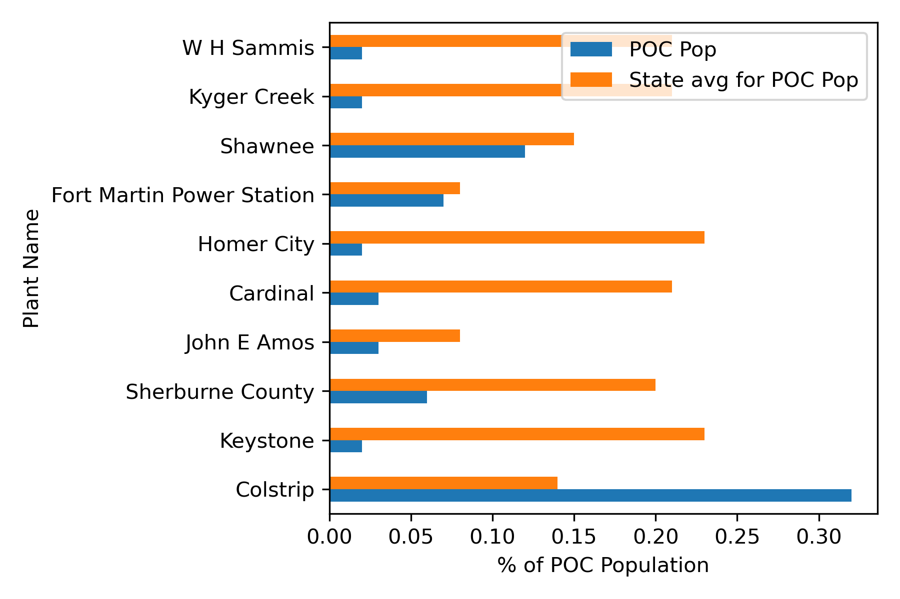
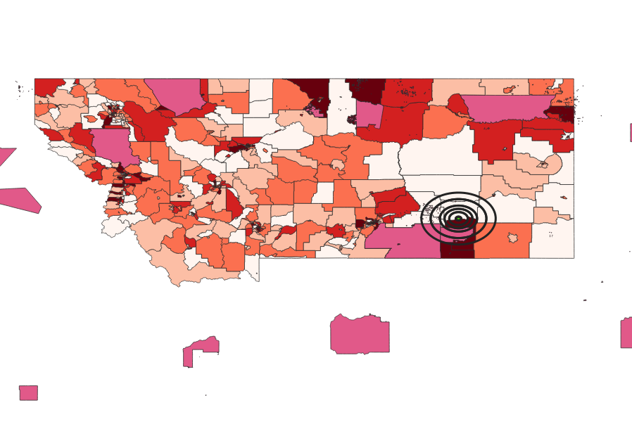

# Title: Decomissioning Coal Plants & The Health Impact on Environmental Justice Communities

## Background & Objective: 

People of color are disproportionately affected by climate change and other environmental degradations. This analysis attempts to understand how much of an impact decomissioning coal plants would have on demographics according to race. Using data from the EPA Environmental Justice Screen, Census block group data, Census boundary shapefiles, and a Marginal Damage Modeligng tool, the repository generates a series of scripts that first attempts to understand the relationship between coal plants and the relative number of people of color within a 3 mile radius of that plant. It then delves deeper into the high emitting plants to determine of those plants, are there more people of color close to the plant in comparison to the rest of the state. Based on these findings, the marginal damage was calculated to exemplify the economic value that would be saved if the plant was decomissioned. 

## External Data
1. **EPA EJ Screening Data:**  

    **Details:** Plant level data set that provides demographic and emissions data within a 3 mile radius of the plant.

    **Access:** Go to **https://www.google.com/url?q=https://www.epa.gov/airmarkets/power-plants-and-neighboring-communities%23mapping&sa=D&source=docs&ust=1652111663312706&usg=AOvVaw0IG-me_26HXoBMcHQsbmT3** and select download where it says “Power Plants and Neighboring Communities (xlsx)” under the “Additional Graphs and Data” section. 

1. **Census 2021 Block Group API:**
     
    **Access:** Go to **https://api.census.gov/data/key_signup.html** and request an API key. 

1. **Census 2021 Block Group Shape File:**

    **Access:** Go to **https://www.census.gov/geographies/mapping-files/time-series/geo/cartographic-boundary.html** and under Census Block groups, select Montana. Store file in folder with scripts.

1. **Census 2021 Shape File for American Indian/Alaska Native Areas/Hawaiian Home Lands:**
    **Access:** Go to **https://www.census.gov/geographies/mapping-files/time-series/geo/cartographic-boundary.html** and under American Indian Tribal Subdivisions select shapefile.Store file in folder with scripts.

1. **Marginal Damage Modeling Tool:**
    
    **Details:**This script uses data from The Air Pollution Emission Experiments and Policy analysis (APEEP) model. 
    
    **Access:** Go to **https://public.tepper.cmu.edu/nmuller/APModel.aspx** and sign up in order to get access to the data file. Once you are logged in, navigate to APEEP Platform tab and select “Marginal Damages (2011) from Holland, Mansur, Muller, Yates AER forthcoming.xlsx” to download the file. 

## Scripts:
### A. Script filter.py
**Purpose:**
1. The data file is very large and a separate csv will need to be created that has a list of the column names from the “Power Plants and Neighboring Communities (xlsx)” and another column that has an x in it marking the column names you’d like to bring into the script. 

1. This script filters through the large excel file that was downloaded from the EPA and renames the column names of the existing file in order to make it easier to analyze.

**Output:**
1.  The output of this script is "coal_plants_communities.csv" which will be used in later scripts for analysis. 
        
### B. Script high_emissions.py
**Purpose:**
1. This script plots a regression of the annual net generation of coal plants to the PM Emissions.
1. The script generates a box plot of the state percentile people of color to PM Emissions. This will demonstrate if there is a relationship between the number of people of color relative to the state to the amount of PM emissions.
1. It also creates a horizontal bar graph that compares the state average people of color, to the population of people of color within the 3 mile radius near the coal plant.

**Output:**
1. This script shows that one plant in comparison to the other top emitting plants has a relatively high population of people of color in comparison to the state average.
1. Three png files:
    1. "Net_Gen_PM_Emissions.png", showing the net generation of all coal plants to their corresponding PM emissions.
    1. "State_pctile_poc_emissions.png", showing a box plot that plots the state percentile people of color to PM Emissions. 
    1. "POC_comparison.png", showing the of the top emitting plants comparing the population within the 3 mile radius near the plant to the state average people of color population.
    1. One csv file, “"high_emmissions_coal_plants.csv", listing the plants that are emitting more than 3000 PM tons.

### C. Script census.py
**Purpose:**
1. This script calls an API to collect block group level data for the state of Montana. It then calculates the people of color by subtracting the total number of white people in the population from the total population. 
1. The script also produces a corresponding GEOID for each of the demographic data points.

**Output:**
1. It produces a "mt_poc.csv", which contains demographic information (number of people of color, white people, total population) for the state of Montana with its corresponding COUNTYFP and STATEFP. 

### D. Script rings.py
**Purpose:**
1. This script builds rings around the plant located in Montana that is a high polluting plant with a relatively high population of people of color within those rings.
1. There are a series of rings (3, 10, 15, 20, 30, 40) in which units are in miles.
1. This script creates two geopackages that will be used later to input into QGIS.

**Output:**
1. Two gpkg files:
    1. "Mt_high_emissions.gpkg", with a “plant” layer showing where the plant is located based on the latitude and longitude of the plant.
    1. "Mt_high_emissions.gpkg", with a “ring” layer showing a series of rings around the plant.
    1. A csv file, "mt_plant_data.csv" showing the demographic and pollution information from the plant in Montana.

### E. Script plotting.py
**Purpose:**
1. This script graphs the three dimensional relationship between the number of people of color within the different rings created in “rings.py” to the general share of people of color within the state.

**Output:**
1. The output shows that there is a larger share of people of color within the rings than the rest of the state. It also identifies that the EPA does not capture all of the disparities, given they only give information on the demographics within 3 miles of the plant.
1. One png file, “POC_high_emissions.png”, showing the distribution of people of color within Montana.

### F. Script join.py
**Purpose:**
1. This script joins the demographic census data from the API to the shape file pulled from the link above. 
1. It also creates a spatial join of the geopackage rings layer, with the demographic information. This spatial join allows for the calculation of how many people of color within the rings  of the plant, specifically you can see how many of each demographic makes up people of color near the plant.

**Output:**
1. The output is a csv file, "ring_info.csv", showing the demographic information within the rings created from the previous script, where the rings are in miles.

### G. Script md.py
**Purpose:**
1. This script calculates the marginal damage of PM pollution in the county where the plant is located. The script calculates the amount of tons of pollution of the plant and multiplies it by the marginal damage in the file.

**Output:**
1. The output is a csv file, "md_mt_plant.csv", that indicates the demographic and plant based data including the marginal damage for the pollution in the county.

### H. QGIS mt_plant_emissions.qgz
**Purpose:**
1. This QGIS file looks at a few different things:
    1. The demographics of the state of Montana 
    1. The demographics with the rings around the high emitting plant
    1. Where tribal reservations are relative to the plant
    1. This visual aid allows you to see the varying demographics and identify that there is a greater amount of people of color near the rings than the state.

**Output:**
1. A png of the state of Montana, it’s corresponding demographics, the plant and the rings by exporting to an image. Make sure the layers are in the following order:
    1. Mt_high_emissions - rings
    1. Census 2021 AIANNH
    1. Mt_high_emissions - plant
    1. Mt_high_emissions - bg

## Results

From these scritps it was it was identifed that the Colstrip Coal Plan is one of the top emitting plants in the country, with a larger popoulation of people of color in comparison to the rest of the state. 

It was also determined that the Native American reservations, Crow and Northern Cheynne, are the primary population that makes up that people of color population near the plant. Given that it does not appear that Colstrip is owned by a Native American tribe, it is suggested that this plant is closed down in order to save **$48,562,481** in marginal damages. It is also suggested that the EPA increase the radius of demographics in the EJ data set in order to capture greater demographic disparities.

